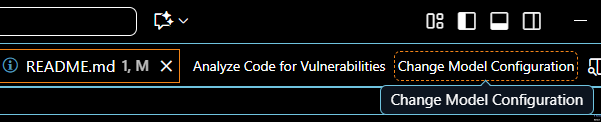
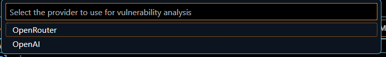
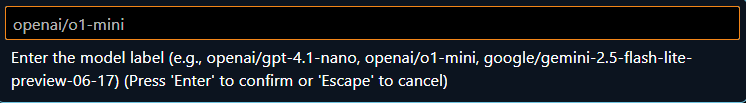
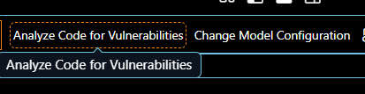
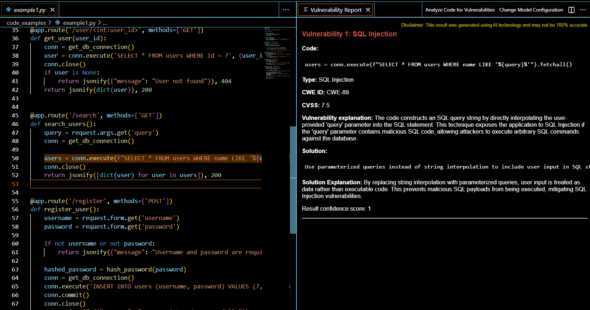
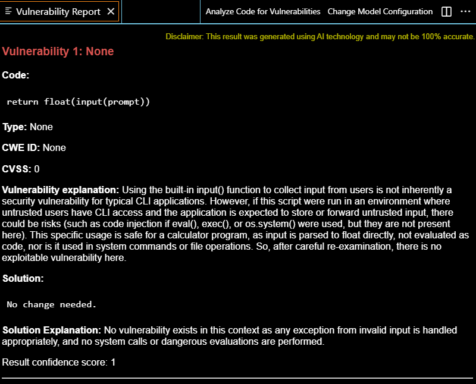
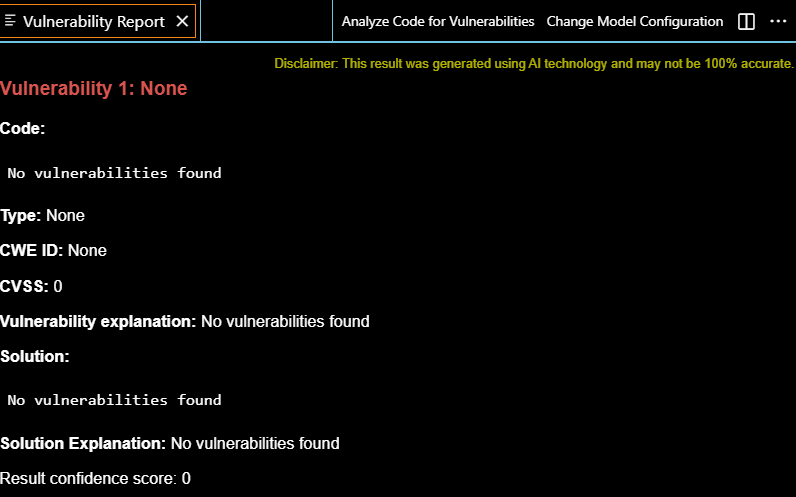
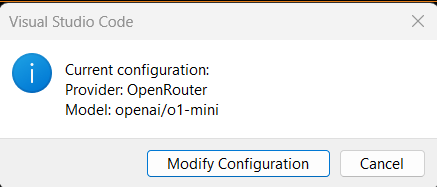

# Vulnerability Code Detector

Detect vulnerabilities in source code using AI models directly from Visual Studio Code.

## Features
- Source code analysis for security vulnerabilities.
- Support for multiple languages (Python, Java, C, JavaScript, Terraform, etc.).
- Detailed results with explanation, vulnerability type, CWE, CVSS, and recommended solution.
- Integrated commands in the editor's toolbar.

## Installation
1. Install the extension from the VS Code Marketplace.
2. Open Visual Studio Code and go to the Extensions section.
3. Search for "VulnerabilityCodeDetector" and install it.

## Get Started
1. **Create the environmental variables** `OPENROUTER_API_KEY` and/or `OPENAI_API_KEY`.
- To create the Open AI API KEY follow this documentation: https://platform.openai.com/api-keys
- On the other hand, for Open Router use: https://www.kerlig.com/help/integrations/open-router/get-api-key
Once, you have created your API keys configure them to be used by the plugin.
```
$env:OPENAI_API_KEY="my_openai_key"
$env:OPENROUTER_API_KEY="my_openrouter_key"
```
```
export OPENAI_API_KEY="my_openai_key"
export OPENROUTER_API_KEY="my_openrouter_key"
```

2. **Configure the platform and model** you want to use.
- Click the button "Change Model Configuration" and select which platform you want (OpenAI or OpenRouter).


- Once selected, indicate the tag model to use. You can visit https://openrouter.ai/models to search all OpenRouter models and https://platform.openai.com/docs/models for OpenAI.

3. Now you can start to use the tool!

## Usage

### Step-by-step Usage

1. **Open a source code file** in the VS Code editor.
2. **Analyze the code**:
   - Click the "Analyze Code for Vulnerabilities" button in the editor title bar or run the command from the command palette (`Ctrl+Shift+P` > `Analyze Code for Vulnerabilities`).

   
3. **Review the Vulnerability Report**:
   - After analysis, a new "Vulnerability Report" window opens on the right.
   - The report includes: vulnerable code fragment, vulnerability type, CWE, CVSS, explanation, and recommended solution.
   - Vulnerable code is highlighted in orange in the source file.
   

   - If no vulnerabilities are found, this is indicated in the Report along an explanation. This Report was generated using GPT-4.1 model and may vary when using other models.
   

   Another example of a "no vulnerabilities found" report generated with a different model.
   

4. **Navigate vulnerabilities**:
   - Click the vulnerability title in the report to jump directly to the corresponding line in your code.
5. **Change AI model**:
   - Use the "Change Model Configuration" command or button to select a different provider or model.
   

**Tips:**
- Free models are available on OpenRouter (e.g., `openai/gpt-oss-20b:free`, `google/gemini-2.0-flash-exp:free`).
- You can re-analyze the file after making code changes.
- The tool was tested and evaluated using OpenAI’s gpt-4.1-2025-04-14 model, other models may produce inaccurate results.

### Interpreting Results

- **Vulnerable Fragment**: The exact code lines detected as vulnerable.
- **Vulnerability Type**: Classification (e.g., SQL Injection, XSS).
- **CWE/CVSS**: Industry-standard identifiers and severity scores.
- **Explanation**: Why the code is vulnerable.
- **Solution**: Recommended fix or mitigation.

### Troubleshooting

- If no vulnerabilities are found, try with different models or review your code for edge cases.
- If the API key is missing or invalid, check your environment variable setup.

## Available Commands
- `analyzeCode`: Analyzes the open code for vulnerabilities.
- `changeProviderModel`: Changes the AI model used for analysis.

## Requirements
- Visual Studio Code >= 1.96.0
- Node.js >= 20.x for local development

## Contributing
Contributions are welcome. Please open an issue or pull request on GitHub https://github.com/BlancaCal/VulnDetectorPlugin.

## License
MIT License. See the LICENSE file for details.

## Support
For questions or issues, open an issue in the repository https://github.com/BlancaCal/VulnDetectorPlugin.
